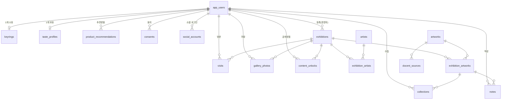

# DB 스키마 문서

`db/schema.ts` 기준. PRD(Requirement 8개 / Feature 15개)를 지원하기 위해 설계된 도메인 테이블 정리.

## 전체 관계도

## 인증 (기존, Phase 0 이전부터 존재)

### `app_users`
| 컬럼 | 타입 | 설명 |
|---|---|---|
| id | bigserial PK | |
| username | varchar(20) | 대소문자 무시 unique |
| password_hash | text nullable | 로컬 계정의 bcrypt 해시. 소셜 전용 계정은 null |
| role | varchar(20) | `visitor` \| `exhibition_operator` \| `content_operator`. **이번에 추가됨** — Issue #16/#17(운영자 화면)의 권한 체크 근거 |
| created_at | timestamptz | |

### `auth_sessions`
| 컬럼 | 타입 | 설명 |
|---|---|---|
| id | bigserial PK | |
| user_id | bigint FK → app_users | cascade delete |
| token_hash | char(64) unique | |
| expires_at | timestamptz | |
| created_at | timestamptz | |

### `social_accounts`
| 컬럼 | 타입 | 설명 |
|---|---|---|
| id | bigserial PK | |
| user_id | bigint FK → app_users | cascade delete |
| provider | varchar(20) | `kakao` |
| provider_user_id | varchar(255) | 제공자가 발급한 사용자 고유 ID |
| email | varchar(320) nullable | 제공자가 동의 범위에서 반환한 이메일 |
| display_name | varchar(120) nullable | 제공자가 반환한 닉네임/이름 |
| profile_image_url | text nullable | 제공자가 반환한 프로필 이미지 URL |
| created_at / updated_at | timestamptz | |

`(provider, provider_user_id)` 조합은 unique다. OAuth access/refresh token은 저장하지 않는다.

---

## 전시 / 작가

### `exhibitions`
| 컬럼 | 타입 | 설명 |
|---|---|---|
| id | bigserial PK | |
| title | varchar(120) | |
| description | text | |
| hero_image_url | text | |
| venue | varchar(160) | |
| start_at / end_at | timestamptz | 운영 기간 |
| operating_hours | varchar(160) | |
| status | varchar(20) | `upcoming` \| `ongoing` \| `ended` — 자동 제안 + 운영자 승인 방식(이슈 #16 미결 슬롯 권장안) |
| published | boolean | 공개 여부 |
| created_by | bigint FK → app_users | 등록 운영자 |
| created_at / updated_at | timestamptz | |

### `artists`
| 컬럼 | 타입 | 설명 |
|---|---|---|
| id | bigserial PK | |
| name | varchar(120) | |
| bio | text | |
| created_at | timestamptz | |

### `exhibition_artists` (전시 ↔ 작가, N:N)
| 컬럼 | 타입 | 설명 |
|---|---|---|
| id | bigserial PK | |
| exhibition_id | bigint FK → exhibitions | cascade |
| artist_id | bigint FK → artists | cascade |
| — | unique(exhibition_id, artist_id) | 중복 연결 방지 |

---

## 작품

작품은 **공통 정보 + 전시별 연결**로 분리 (이슈 #17 미결 슬롯: "동일 작품이 여러 전시에 반복될 때" 권장안 적용). 같은 작품이 여러 전시에 나와도 `artworks`는 하나만 존재하고, 전시마다의 수집 식별값/설명은 `exhibition_artworks`에 따로 둠.

### `artworks` (공통 정보)
| 컬럼 | 타입 | 설명 |
|---|---|---|
| id | bigserial PK | |
| title | varchar(160) | |
| artist_id | bigint FK → artists | nullable |
| production_year | varchar(20) | |
| material | varchar(160) | |
| image_url | text | |
| base_description | text | |
| appreciation_points | text | 감상 포인트 |
| created_at | timestamptz | |

### `exhibition_artworks` (전시별 연결)
| 컬럼 | 타입 | 설명 |
|---|---|---|
| id | bigserial PK | |
| exhibition_id | bigint FK → exhibitions | cascade |
| artwork_id | bigint FK → artworks | cascade |
| collect_identifier | varchar(120) | QR/NFC/코드 공용 식별값 |
| exhibition_description | text | 전시별 설명 |
| published | boolean | |
| created_at | timestamptz | |
| — | unique(exhibition_id, collect_identifier) | **동일 전시 내 식별값 중복 방지** (이슈 #17 완료조건) |
| — | unique(exhibition_id, artwork_id) | 같은 작품 중복 연결 방지 |

> 작품 수집(`collections`), 한줄평(`notes`)은 `artworks`가 아니라 `exhibition_artworks`를 참조함 — "이 전시에서 이 작품을 수집/감상했다"는 맥락이 중요하기 때문.

---

## 방문 / 키링 / 작품 수집

### `keyrings`
| 컬럼 | 타입 | 설명 |
|---|---|---|
| id | bigserial PK | |
| user_id | bigint FK → app_users, **unique** | 계정당 키링 1개 (MVP, 소유권 이전 제외) |
| keyring_code | varchar(64) unique | 실물 키링 식별값 |
| connected_at | timestamptz | |

### `visits` (방문 인증)
| 컬럼 | 타입 | 설명 |
|---|---|---|
| id | bigserial PK | |
| user_id | bigint FK → app_users | cascade |
| exhibition_id | bigint FK → exhibitions | cascade |
| visited_at | timestamptz | |
| — | unique(user_id, exhibition_id) | 전시당 방문 인증 1회 |

### `collections` (작품 수집 기록)
| 컬럼 | 타입 | 설명 |
|---|---|---|
| id | bigserial PK | |
| user_id | bigint FK → app_users | cascade |
| exhibition_artwork_id | bigint FK → exhibition_artworks | cascade |
| collected_at | timestamptz | |
| — | unique(user_id, exhibition_artwork_id) | **중복 수집 방지** (이슈 #7 완료조건) |

---

## 감상 기록

### `notes` (한줄평)
| 컬럼 | 타입 | 설명 |
|---|---|---|
| id | bigserial PK | |
| user_id | bigint FK → app_users | cascade |
| exhibition_artwork_id | bigint FK → exhibition_artworks | cascade |
| content | varchar(200) | 최대 200자 (이슈 #10 미결 슬롯 권장안) |
| visibility | varchar(20) | 기본값 `private` |
| created_at / updated_at | timestamptz | |
| — | unique(user_id, exhibition_artwork_id) | 작품당 한줄평 1개 |

### `gallery_photos` (나만의 갤러리)
| 컬럼 | 타입 | 설명 |
|---|---|---|
| id | bigserial PK | |
| user_id | bigint FK → app_users | cascade |
| exhibition_id | bigint FK → exhibitions | cascade |
| file_ref | text | 사진 파일 참조값 |
| analysis_consent | boolean | 사진 분석 활용 동의 여부 (기본 false) |
| created_at | timestamptz | |

> 전시별 저장 한도(권장 50장)는 DB 제약이 아니라 API 레벨에서 체크.

---

## AI 도슨트

### `docent_sources` (근거 자료)
| 컬럼 | 타입 | 설명 |
|---|---|---|
| id | bigserial PK | |
| artwork_id | bigint FK → artworks | cascade |
| source_type | varchar(40) | 출처 유형 |
| source_info | text | 출처 정보 |
| body | text | 본문 |
| published | boolean | |
| review_status | varchar(20) | `pending` \| `approved` \| `rejected` |
| created_at | timestamptz | |

---

## 취향 / 추천

### `taste_profiles`
| 컬럼 | 타입 | 설명 |
|---|---|---|
| id | bigserial PK | |
| user_id | bigint FK → app_users, **unique** | 사용자당 1개 |
| items | jsonb | 취향 항목(근거 포함) 배열 |
| updated_at | timestamptz | |

### `product_recommendations`
| 컬럼 | 타입 | 설명 |
|---|---|---|
| id | bigserial PK | |
| user_id | bigint FK → app_users | cascade |
| product_ref | varchar(120) | 외부 제품 식별값 |
| reason | text | 추천 근거 |
| impressed_at / clicked_at / saved_at / dismissed_at | timestamptz | 노출·클릭·저장·관심없음 시점 (nullable) |
| created_at | timestamptz | |

---

## 시간차 콘텐츠 공개

### `content_unlocks`
| 컬럼 | 타입 | 설명 |
|---|---|---|
| id | bigserial PK | |
| user_id | bigint FK → app_users | cascade |
| exhibition_id | bigint FK → exhibitions | cascade |
| content_type | varchar(40) | 콘텐츠 유형(관람요약/숨은해설/비하인드 등) |
| unlock_at | timestamptz | 공개 시점 |
| viewed_at | timestamptz | 열람 시점(nullable) |
| — | unique(user_id, exhibition_id, content_type) | |

---

## 동의

### `consents`
| 컬럼 | 타입 | 설명 |
|---|---|---|
| id | bigserial PK | |
| user_id | bigint FK → app_users | cascade |
| type | varchar(30) | `required` \| `personalization` \| `photo_analysis` \| `marketing` |
| granted | boolean | 기본 false |
| updated_at | timestamptz | |
| — | unique(user_id, type) | |

---

## 설계 결정 사항 (PRD 미결 슬롯)

| 항목 | 결정 | 근거 |
|---|---|---|
| 한줄평 최대 글자 수 | 200자 | `notes.content` varchar(200) |
| 동일 작품 여러 전시 반복 | 공통 정보 + 전시별 연결 | `artworks` + `exhibition_artworks` 분리 |
| 전시 상태 전환 | 자동 제안 + 운영자 승인 | `exhibitions.status`는 운영자가 최종 반영(로직은 API 레벨) |
| 갤러리 사진 저장 한도 | 50장 (권장) | DB 제약 아님, API 레벨에서 체크 |
| 운영자 권한 구분 | `app_users.role` 컬럼 추가 | Issue #16/#17 권한 체크 근거 |

마이그레이션: `drizzle/0001_great_arclight.sql` (`npm run db:generate`로 생성)

---

## 이미지 저장소는 아직 미정

`exhibitions.hero_image_url`, `artworks.image_url`, `gallery_photos.file_ref`는 모두 **사진 파일 자체가 아니라 파일이 있는 위치를 가리키는 문자열(`text`)**만 저장한다. 실제 사진 바이너리는 별도의 오브젝트 스토리지(Cloudflare R2, AWS S3 등)에 저장하고, 그 위치 값만 이 컬럼에 넣는 구조다.

어떤 오브젝트 스토리지를 쓸지는 **배포 플랫폼이 무엇이냐에 따라 달라지고, 아직 결정되지 않았다** (배포 플랫폼 자체도 미정 — Cloudflare Workers / Render 등 검토 중, 관련 논의는 별도 이슈 참고).

이 설계(참조값만 저장)는 어떤 스토리지를 고르든 스키마 변경이 필요 없도록 의도한 것이므로, 배포 플랫폼이 정해지기 전까지 스키마를 먼저 바꿀 필요는 없다. 다만 실제 업로드 기능(사진을 스토리지에 저장하고 참조값을 써넣는 API)은 배포 플랫폼이 정해지기 전까지 구현할 수 없다.
